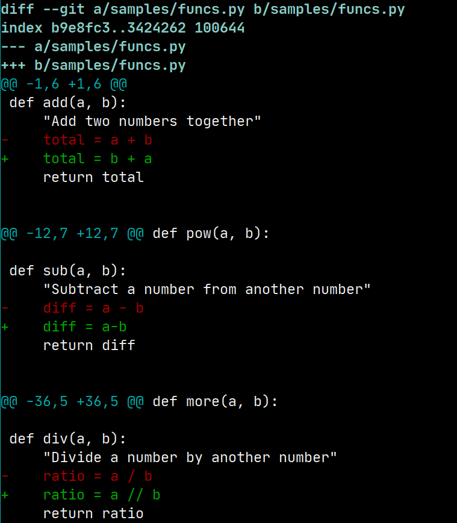
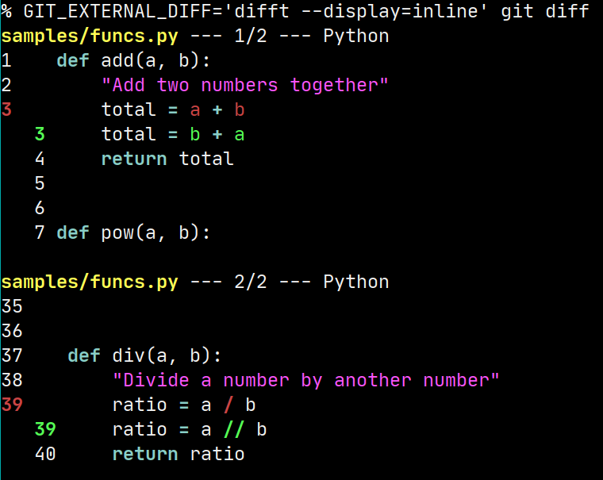
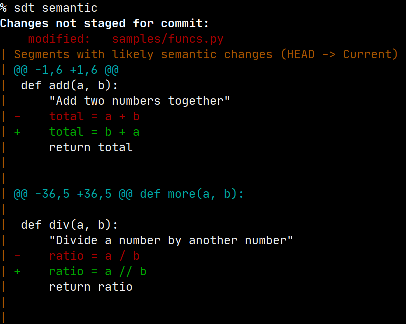
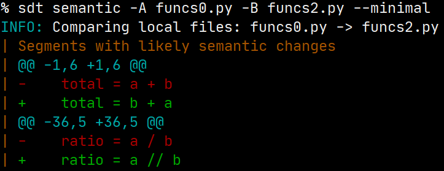
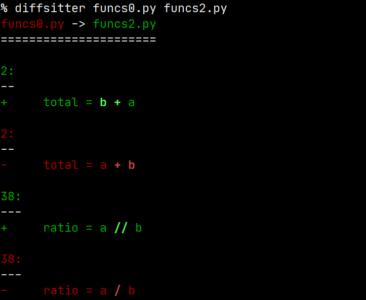

# Related tools

Semantic Diff Tool has [some similarities](related_tools.md) with Difftastic
and AST Explorer.  Take a look at the discussion at that link.  If you know
of other useful comparisons, please let us know (or push a PR).

## Difftastic

[Difftastic](https://github.com/Wilfred/difftastic) (`difft`) serves a
largely overlapping purpose to `sdt`.  Difftastic builds on the substantial
and longstanding work in
[tree-sitter](https://github.com/tree-sitter/tree-sitter), which is a parser
generator tool for which many grammars and interfaces have been created.

Semantic Diff Tool is much newer and less developed; but `sdt` also takes a
much more heuristic approach.  That is, `difft` will answer the question
"*exactly* what has changed between these two versions of a file at an AST
level?"  In contrast, `sdt` aims to answer the somewhat narrower question
"which segments of the diff are likely to be semantically important?"
Specifically, `sdt` is meant to aid code reviewers in excluding merely
stylistic changes and focus on (likely) functional changes.

This difference is reflected in the different approaches to comparing files
the two tools take.  Instead of relying on fixed and compiled-in versions of
parsers as `difft` does, `sdt` dynamically calls external tools (which can
be whichever specific version of those is used by a project).  

As a consequence, using `difft` with a project that, e.g., utilizes Python
3.8 is difficult to impossible.  At the least, it would require recompiling
the Rust tool with dependencies on whichever older version of
[tree-sitter-python](https://github.com/tree-sitter/tree-sitter-python) has
specifically 3.8-level syntax.  In contrast, `sdt` can be easily and
dynamically configured to utilize an appropriate Python executable, such as
`/usr/local/bin/python3.8`.

As an illustration, in the following screenshots, `git diff` shows three
segments where surface changes were made to a small test file.  The first
and third—but not the second—segment is semantically meaningful to what the
program does.  Both `difft` and `sdt` correctly identify this fact; but
`sdt` presents a display closely modeled on `git diff` itself while `difft`
highlights *exactly* those characters that represent a change (using a
somewhat idiosyncratic, but clear, format).  These examples are included as
screenshots rather than as marked text to preserve the use of color
highlighting by all three tool.

```
% git diff
```



```
% GIT_EXTERNAL_DIFF='difft --display=inline' git diff
```



```
% sdt semantic
```



## diffsitter

The [command-line utility
`diffsitter`](https://github.com/afnanenayet/diffsitter) is very similar in
design to Difftastic, and not so far from the tree-sitter mode of SDT.
Diffsitter is built in Rust, and links (usually statically links) to
tree-sitter grammars for those numerous languages.

Diffsitter is not inherently git-aware, as SDT is, but it (currently) has
nicer packaging than SDT, via `cargo`, `brew`, and `apk`.  I also want to
borrow its provision of shell completion, which is a nice integration.  My
quick attempt at using an external variable for `git diff` fails for
`diffsitter` for reasons that are not immediately obvious to me; but I
suspect this could be remedied with some sort of thin wrapper, i.e.:

```
% GIT_EXTERNAL_DIFF='diffsitter' git diff
error: Found argument 'b9e8fc3459023476309388d0adecf99b835c0f94' which
wasn't expected, or isn't valid in this context

Usage: diffsitter [OPTIONS] [OLD] [NEW] [COMMAND]

For more information try '--help'
fatal: external diff died, stopping at samples/funcs.py
```

We can again provide screenshots to show the different colorized visual
displays of `diffsitter` versus `sdt`.  These examples compare on-disk
files, but are the same comparison as used with Difftastic (i.e. two Python
files containing both functional and non-functional changes across different
functions:

```
% sdt semantic -A funcs0.py -B funcs2.py --minimal
```



```
% diffsitter funcs0.py funcs2.py
```



## AST Explorer

[AST Explorer](https://github.com/fkling/astexplorer) is somewhat similar in
concept to Difftastic.  It is written in JavaScript, and uses
language-native parsers to support numerous programming languages.  It does
not attempt to provide diff'ing, but adding that would be relatively
straightforward.  That was, in fact, the initial but discarded approach
taken by the creator of `sdt`.

However, after some initial development, I realized that the quality of the
third-party JS parsers that AST Explorer utilizes are often poor, and fail
to recognize many commonplace constructs of the languages they respectively
process.  AST Explorer itself exposes a very nice [web-based front
end](https://astexplorer.net/), but beyond the sample files of many source
languages it provides, the tool often fails to parse valid source code.

